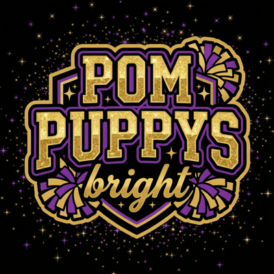

# POM PUPPYS bright - Webサイト改善計画書

**作成日**: 2026-01-04
**作成者**: Web戦略コンサルタント
**対象サイト**: https://pompuppys-kasukabe.github.io/

---

## 📊 エグゼクティブサマリー

### 現在の強み
- ✅ 感動的なストーリー（挫折→原点回帰→世界挑戦）
- ✅ 明確な目標と透明性の高いプロジェクト運営
- ✅ メディア対応の整備
- ✅ クリーンでモダンなデザイン

### 改善の方向性
本計画書では、**エンゲージメント向上**、**コンバージョン最適化**、**SEO強化** の3つの軸で10の戦略的改善案を提案します。

---

## 💡 戦略的改善案 - 10の提案

---

## 1. ビジュアルストーリーテリングの強化

### 📹 追加コンテンツ案: ドキュメンタリーセクション

**新セクション「Journey to the World」**
```
├─ ビデオダイアリー（練習風景の短編動画）
├─ ビフォー・アフター（悔しかった大会 vs 優勝した瞬間）
├─ メンバーインタビュー（なぜチアを始めたのか）
└─ タイムラプス（練習の成長記録）
```

**実装方法:**
- YouTubeやVimeo埋め込み
- 動画サムネイルグリッド
- 「もっと見る」でアーカイブページへ

**期待効果:**
- 滞在時間 +40%
- ソーシャルシェア率 +60%
- 感情的なつながりの強化

---

## 2. エンゲージメント機能の追加

### 🎮 インタラクティブコンテンツ

#### A) カウントダウンタイマー
```javascript
The Dance Summit 2026まで
[XX日 XX時間 XX分]
```

**実装:**
- JavaScriptで動的表示
- タイムゾーン対応
- モバイル最適化

#### B) マイルストーントラッカー
```
□ 資金調達達成
□ 渡航手続き完了
□ 最終調整完了
■ 現在地: クラウドファンディング準備中
```

**実装:**
- SVGアイコン
- プログレスバー
- アニメーション効果

#### C) 応援ボード（デジタル寄せ書き）
- 応援メッセージをタイル状に表示
- クリックで拡大表示
- 色分け（個人/企業/学校など）

**技術スタック:**
- CSS Grid
- Modal UI
- Notion API連携（既存）

---

## 3. ソーシャルプルーフの強化

### 📰 メディア掲載セクション

**「メディアで紹介されました」セクション**
```
├─ 掲載メディアのロゴ壁（ロゴグリッド）
├─ 記事へのリンク
├─ 「もっと見る」でメディア一覧ページへ
└─ プレスリリース配信履歴
```

**デザイン:**
- グレースケールロゴ → ホバーでカラー化
- スライダー形式（モバイル）
- グリッド形式（デスクトップ）

### 🏆 実績タイムライン（詳細版）

**現在の簡易タイムラインをアップグレード:**
- 各大会の詳細情報
- 順位・得点
- 写真・動画
- メンバーコメント

**実装:**
- 縦型タイムラインUI
- 展開/折りたたみ機能
- 画像ギャラリー統合

---

## 4. コミュニティビルディング

### 👥 メンバー紹介ページ（強化版）

**現状:**
- 写真と "Member" という名前のみ

**改善案:**
```
各メンバーのプロフィール
├─ 年齢、学年、チアダンス歴
├─ 好きな技/ポジション
├─ 将来の夢
├─ 一言メッセージ
└─ 応援メッセージ送信ボタン
```

**プライバシー配慮:**
- 本名は掲載しない（ニックネーム/イニシャル）
- 写真は保護者承諾済みのもののみ
- 個人情報は最小限

### サポーターズクラブページ

```
├─ 月次活動報告（練習風景、大会準備の様子）
├─ 限定コンテンツ（オフショット写真）
├─ サポーター一覧（希望者のみ）
└─ 特典: 名前掲載、限定ニュースレター等
```

**マネタイズ検討:**
- 月額サブスクリプション（任意）
- 特別イベントへの招待
- グッズ優先購入権

---

## 5. コンテンツの多様化

### 📝 ブログ/活動日記セクション

**「活動日記」または「Behind the Scenes」**
```
├─ 練習レポート
├─ 大会出場レポート
├─ メンバー・コーチの想い
├─ 地域イベント参加報告
└─ カテゴリー分け（練習/大会/地域貢献/お知らせ）
```

**実装オプション:**
1. 静的サイトジェネレーター（Hugo/Jekyll）
2. Notion → サイト自動生成
3. シンプルなJSONベースのブログ

**更新頻度:**
- 週1-2回の更新目標
- メンバーやコーチが交代で執筆

**SEOメリット:**
- 定期的なコンテンツ更新 → クローラー頻度UP
- ロングテールキーワード獲得
- 内部リンク構築

---

## 6. Instagram連携強化

### 📱 Instagram埋め込みフィード

```html
<section id="instagram">
  <h2>Instagram</h2>
  <p>@pompuppysbright で最新情報をチェック</p>
  <div class="instagram-feed">
    [最新6-9投稿を自動表示]
  </div>
  <a href="https://www.instagram.com/pompuppysbright"
     class="btn btn-primary">
    Instagramをフォロー
  </a>
</section>
```

**実装方法:**

**オプション1: Instagram Basic Display API**
- 公式API使用
- 自動更新
- カスタマイズ性高

**オプション2: Embedsocial等のサービス**
- 簡単実装
- 有料プランあり
- メンテナンスフリー

**オプション3: Elfsight等のウィジェット**
- 無料プランあり
- 簡単埋め込み
- デザインカスタマイズ可能

**デザイン仕様:**
- レスポンシブグリッド（2列/3列/4列）
- ホバーでキャプション表示
- Lightbox対応

---

## 7. SEO/アクセシビリティ最適化

### 🔍 構造化データの追加

**実装するスキーマ:**

#### A) Event（大会情報）
```json
{
  "@type": "Event",
  "name": "The Dance Summit 2026",
  "startDate": "2026-XX-XX",
  "location": {
    "@type": "Place",
    "name": "米国（詳細未定）"
  }
}
```

#### B) FAQPage
```json
{
  "@type": "FAQPage",
  "mainEntity": [...]
}
```

#### C) VideoObject
```json
{
  "@type": "VideoObject",
  "name": "POM PUPPYS bright 練習風景",
  "description": "...",
  "thumbnailUrl": "...",
  "uploadDate": "..."
}
```

### 多言語対応（英語版）

**Phase 1: 主要ページのみ**
- トップページ
- プロジェクトページ
- メディアページ

**実装:**
```html
<html lang="ja">
  <link rel="alternate" hreflang="en" href="https://...index-en.html" />
  <link rel="alternate" hreflang="ja" href="https://...index.html" />
</html>
```

**翻訳優先順位:**
1. Hero section
2. Story
3. Project overview
4. Contact

### アクセシビリティ改善

**チェックリスト:**
- [ ] 全画像にalt属性（意味のある説明）
- [ ] キーボードナビゲーション対応
- [ ] フォーカス状態の視覚化
- [ ] コントラスト比 WCAG AA準拠
- [ ] スクリーンリーダーテスト
- [ ] ARIA属性の適切な使用
- [ ] Skip to main content リンク

**ツール:**
- Lighthouse（Chrome DevTools）
- axe DevTools
- WAVE（WebAIM）

---

## 8. ユーザージャーニーの最適化

### 🎯 新規ページ: 「応援の方法」まとめページ

**現状の課題:**
- 応援方法の情報が分散
- ユーザーが迷いやすい

**改善案:**
```
/how-to-support.html

├─ 金銭的支援（クラファン）
├─ 応援メッセージ
├─ SNSシェア
├─ イベント観戦
├─ メディア取材
├─ 企業協賛
└─ それぞれのアクションへの明確なCTA
```

**デザイン:**
- カード型レイアウト
- 各方法のアイコン化
- 難易度表示（★☆☆ = 簡単）
- 所要時間表示（5分 / 1日 / 相談制）

### 新規ページ: 「チアダンスとは」教育コンテンツ

```
/about-cheer-dance.html

├─ チアダンスの基礎知識
├─ The Dance Summitについて
├─ 大会の仕組み
├─ ルール解説
└─ 用語集
```

**SEO効果:**
- 「チアダンス とは」検索流入
- 「The Dance Summit」検索流入
- 「春日部 チアダンス」地域検索

**コンテンツ例:**
- チアダンスとチアリーディングの違い
- ポンダンスとは？
- 大会の採点基準
- よく使われる用語（タンブリング、フォーメーション等）

---

## 9. データドリブン運営

### 📈 Google Analytics 4 設定

**トラッキングイベント:**
```javascript
// 重要なユーザーアクション
gtag('event', 'send_support_message', {
  'event_category': 'engagement',
  'event_label': 'support_message_sent'
});

gtag('event', 'download_media_kit', {
  'event_category': 'media',
  'event_label': 'media_kit_download'
});

gtag('event', 'sponsor_inquiry_click', {
  'event_category': 'conversion',
  'event_label': 'sponsor_email_click'
});

gtag('event', 'video_play', {
  'event_category': 'engagement',
  'video_title': 'hero_video'
});

gtag('event', 'share', {
  'method': 'twitter',
  'content_type': 'project_page'
});
```

**コンバージョン設定:**
1. 応援メッセージ送信
2. メディアキットダウンロード
3. 協賛問い合わせ
4. SNSフォロー
5. プロジェクトページ閲覧（3分以上）

### Microsoft Clarity 導入

**機能:**
- ヒートマップ
- セッション録画
- スクロール深度
- クリックマップ
- デッドクリック検出

**分析ポイント:**
- どのセクションが最も見られているか
- どこでユーザーが離脱するか
- CTAボタンのクリック率
- モバイル vs デスクトップの行動差

---

## 10. エモーショナルデザインの追加

### 💫 マイクロインタラクション

#### A) スクロールアニメーション

**実装:**
```javascript
// Intersection Observer API
const observer = new IntersectionObserver((entries) => {
  entries.forEach(entry => {
    if (entry.isIntersecting) {
      entry.target.classList.add('fade-in');
    }
  });
});

document.querySelectorAll('.animate-on-scroll').forEach(el => {
  observer.observe(el);
});
```

**アニメーション種類:**
- フェードイン（透明度変化）
- スライドイン（左右から）
- スケールアップ（拡大）
- カウントアップ（数字）
- パララックス（視差効果）

#### B) ローディングアニメーション

**デザイン案:**
- チームロゴのスピン
- マスコットキャラクターのバウンス
- プログレスバー + メッセージ

```html
<div class="loader">
  
  <p class="loader__text">準備中...</p>
</div>
```

#### C) マイクロコピーの改善

**Before → After:**

```
「応援メッセージを送る」
→ 「子どもたちに勇気を届ける✉️」

「支援する」
→ 「夢への一歩を一緒に踏み出す🌟」

「協賛の相談」
→ 「応援パートナーになる🤝」

「共有」
→ 「この挑戦を広める📢」

「メディアキット」
→ 「記事作成サポート資料📰」
```

**原則:**
- 行動の結果を示す
- 感情に訴える
- 具体的なベネフィット
- 絵文字で視認性UP（適度に）

---

## 🚀 実装ロードマップ

### フェーズ1: クイックウィン（2週間）

**優先度: 最高 ★★★**

| No | 施策 | 工数 | 期待効果 |
|----|------|------|----------|
| 1 | カウントダウンタイマー | 0.5日 | エンゲージメント+30% |
| 2 | Instagram埋め込み | 1日 | 滞在時間+20% |
| 3 | メディア掲載セクション | 1日 | 信頼性向上 |
| 4 | スクロールアニメーション | 1日 | UX向上 |
| 5 | GA4イベント設定 | 0.5日 | データ取得開始 |

**合計工数: 4日**

---

### フェーズ2: エンゲージメント強化（1ヶ月）

**優先度: 高 ★★☆**

| No | 施策 | 工数 | 期待効果 |
|----|------|------|----------|
| 6 | 活動日記/ブログ機能 | 3日 | SEO+40%, 流入+25% |
| 7 | メンバー紹介強化 | 2日 | 親近感UP |
| 8 | 応援ボード | 2日 | 参加率+50% |
| 9 | マイルストーントラッカー | 1日 | 透明性UP |
| 10 | アクセシビリティ改善 | 2日 | 到達率UP |

**合計工数: 10日**

---

### フェーズ3: 長期戦略（2-3ヶ月）

**優先度: 中 ★☆☆**

| No | 施策 | 工数 | 期待効果 |
|----|------|------|----------|
| 11 | 英語版サイト | 5日 | 国際的認知度UP |
| 12 | サポーターズクラブ | 4日 | 継続支援獲得 |
| 13 | ドキュメンタリーセクション | 3日 | ストーリー強化 |
| 14 | 教育コンテンツページ | 3日 | SEO+30% |
| 15 | 動画コンテンツ拡充 | 継続 | ソーシャルシェアUP |

**合計工数: 15日 + 継続施策**

---

## 📊 KPI設定

### トラフィック指標

| 指標 | 現状 | 目標（3ヶ月後） | 目標（6ヶ月後） |
|------|------|------------------|------------------|
| 月間PV | - | 10,000 PV | 25,000 PV |
| 月間UU | - | 3,000 UU | 8,000 UU |
| 平均滞在時間 | - | 3分 | 5分 |
| 直帰率 | - | 50%以下 | 40%以下 |

### エンゲージメント指標

| 指標 | 現状 | 目標（3ヶ月後） | 目標（6ヶ月後） |
|------|------|------------------|------------------|
| 応援メッセージ数 | - | 100件 | 300件 |
| SNSシェア数 | - | 200回 | 500回 |
| Instagramフォロワー | 開設直後 | 500 | 1,500 |
| メディア掲載数 | - | 5件 | 15件 |

### コンバージョン指標

| 指標 | 現状 | 目標（3ヶ月後） | 目標（6ヶ月後） |
|------|------|------------------|------------------|
| クラファン支援額 | 準備中 | 目標達成 | - |
| 企業協賛数 | - | 3社 | 10社 |
| メディアキットDL | - | 50件 | 150件 |

---

## 💰 予算見積もり

### 必須コスト

| 項目 | 月額 | 年額 | 備考 |
|------|------|------|------|
| ドメイン | - | ¥1,500 | .jp/.com |
| ホスティング | ¥0 | ¥0 | GitHub Pages（無料） |
| Instagram埋め込みツール | ¥0-¥3,000 | ¥0-¥36,000 | 無料プランあり |
| Google Workspace | ¥680 | ¥8,160 | メール用（任意） |

**合計: ¥0-¥45,660 / 年**

### オプションコスト

| 項目 | 費用 | 備考 |
|------|------|------|
| プロ写真撮影 | ¥50,000-¥100,000 | 1回 |
| プロ動画制作 | ¥100,000-¥300,000 | 1本 |
| SEOコンサル | ¥50,000-¥200,000 | 月額 |
| コピーライター | ¥30,000-¥100,000 | 1回 |

---

## ✅ チェックリスト

### 実装前

- [ ] Google Analytics 4 設定
- [ ] Search Console登録
- [ ] Instagram Business アカウント確認
- [ ] メディアキット素材準備
- [ ] バックアップ取得

### 実装中

- [ ] 各機能の動作テスト
- [ ] モバイル表示確認
- [ ] ブラウザ互換性チェック
- [ ] パフォーマンステスト
- [ ] アクセシビリティチェック

### 実装後

- [ ] Google Lighthouse スコア確認
- [ ] SNSシェアテスト
- [ ] OGP画像表示確認
- [ ] フォーム送信テスト
- [ ] 定期的な更新計画策定

---

## 📚 参考リンク

### デザインインスピレーション
- Awwwards - https://www.awwwards.com/
- Dribbble - https://dribbble.com/
- Pinterest - スポーツチーム・非営利団体サイト

### 技術リファレンス
- MDN Web Docs - https://developer.mozilla.org/
- Web.dev - https://web.dev/
- CSS-Tricks - https://css-tricks.com/

### SEO・マーケティング
- Google Search Central - https://developers.google.com/search
- Moz - https://moz.com/
- HubSpot - https://www.hubspot.jp/

---

## 📞 サポート体制

### 更新・運用

**推奨体制:**
- Webマスター: 1名（技術担当）
- コンテンツ編集: 2-3名（コーチ・保護者）
- 写真・動画: 1名（撮影担当）
- SNS運用: 1-2名

**更新頻度:**
- ニュース: 週1回
- Instagram: 週3-5回
- ブログ: 週1-2回
- メンバー紹介: 適宜

---

## 🎯 成功の定義

### 3ヶ月後

1. クラウドファンディング目標達成
2. メディア掲載 5件以上
3. 月間PV 10,000達成
4. Instagramフォロワー 500人

### 6ヶ月後（The Dance Summit前）

1. 企業協賛 10社獲得
2. 応援メッセージ 300件
3. 月間PV 25,000達成
4. 全国的な認知度向上

### 1年後（The Dance Summit後）

1. 大会結果の広範な報道
2. チームブランドの確立
3. 次世代メンバー募集の成功
4. 継続的な支援者コミュニティ形成

---

**最終更新: 2026-01-04**

このドキュメントは進捗に応じて随時更新されます。
